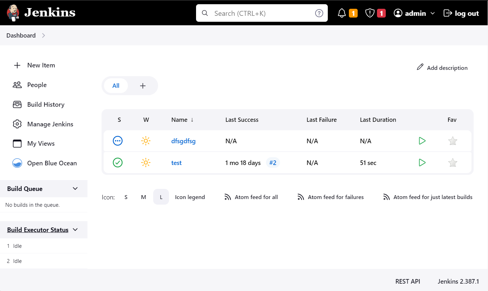
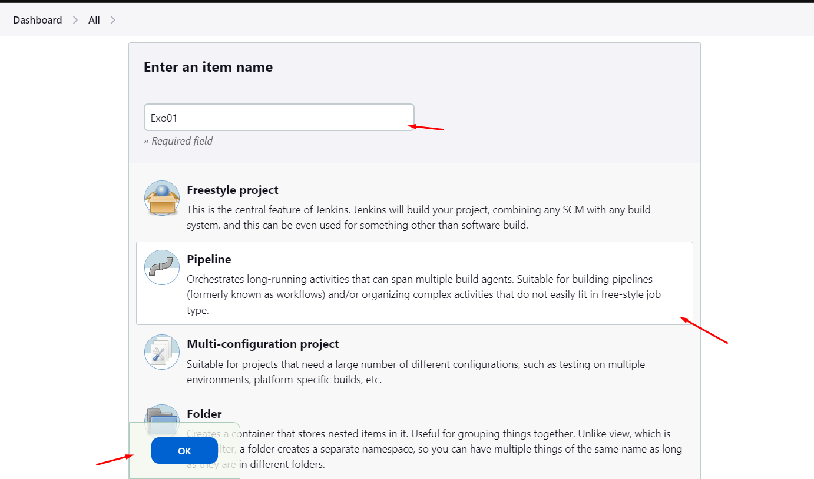
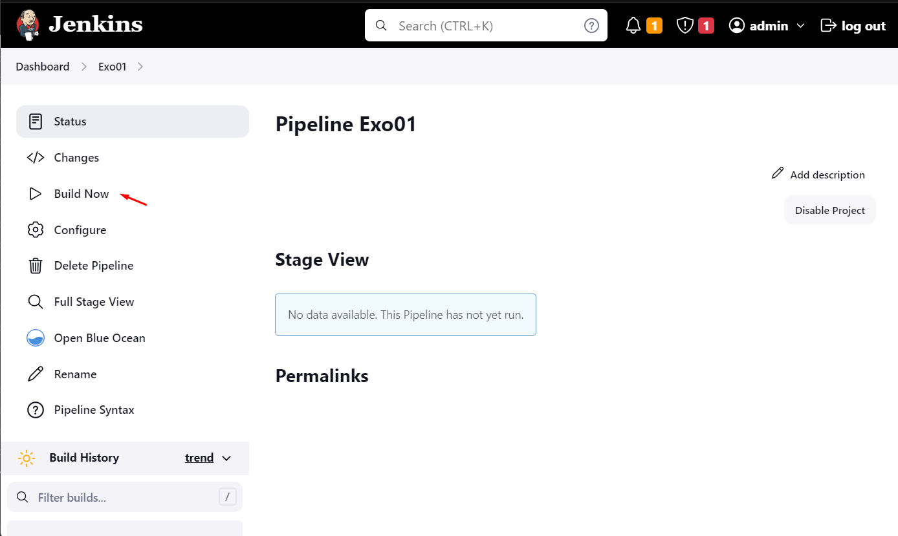

# Exercise 01 : First pipeline

## Aim

Launch your first pipeline

## installed plugins

**Important**: Jenkinsfile syntax is highly dependent upon jenkins server's version and most of
all, upon the list of plugins and versions installed on the server.

The jenkins blue-ocean docker image created via the dockerfile `.docker/jenkins-master-node/Dockerfile`
already includes the following plugins:

- [Pipeline Stage View Plugin](https://plugins.jenkins.io/pipeline-stage-view/) When you have
  complex build Pipelines, it is useful to be able to see the progress of each stage. The
  Pipeline Stage View plugin includes an extended visualization of Pipeline build history on the
  index page of a flow project, under Stage View. (You can also click on Full Stage View to get a
  full-screen view.)
- [blueocean plugin](https://plugins.jenkins.io/blueocean/) allows from other things to edit
   jenkins pipeline inline and provides Native integration for branch and pull requests
- [docker plugin](https://plugins.jenkins.io/docker-plugin/) allows containers to be dynamically
  provisioned as Jenkins nodes using Docker.
- [docker Pipeline plugin](https://plugins.jenkins.io/docker-workflow/) adds the following methods
  to pipeline syntax: withDockerContainer, withDockerRegistry, ... (see [docker workflow pipeline reference](https://www.jenkins.io/doc/pipeline/steps/docker-workflow/)
  for more information)
- [file system SCM plugin](https://plugins.jenkins.io/filesystem_scm/) **!!!CAUTION!!!** use this
  only for this coding dojo and not for production  as this plugin has security issues. It will
  allow us to launch pipeline from a local repository without having to checkout a real git repository.
- [git plugin](https://plugins.jenkins.io/git/) provides fundamental git operations for Jenkins
  projects. It can poll, fetch, checkout, branch, list, merge, tag, and push repositories.
- [email-ext plugin](https://plugins.jenkins.io/email-ext/) allows you to configure every aspect of email
  notifications. You can customize when an email is sent, who should receive it, and what the email says.

The list of activated plugins can be checked on [Plugin manager page](http://localhost:8080/manage/pluginManager/installed).

Please note that this list of plugins could differ on the IT jenkins server configured for your organization.

## Your first pipeline

Using the dashboard you will create your first *pipeline*, by following the next steps:

- from the [jenkins dashboard](http://localhost:8080/) create a new *pipeline* using new item menu


- use `Exo01` as item name

- select `pipeline` type. We will only use *pipeline* type for the rest of the coding dojo.


- search for the *Pipeline* section then manually write the following pipeline code in the *Script* field

```groovy
pipeline {
    agent any 
    stages {
        stage('Stage 1') {
            steps {
                echo 'Hello world!' 
            }
        }
    }
}
```

- click on the save button to save your changes and return to the home page

- select the pipeline that you created then execute the pipeline using `build now` button


- check the [logs of your build](http://localhost:8080/job/Exo01/lastBuild/console), you should
  see "Hello world!"

Congratulations ! You've created your first jenkins pipeline
