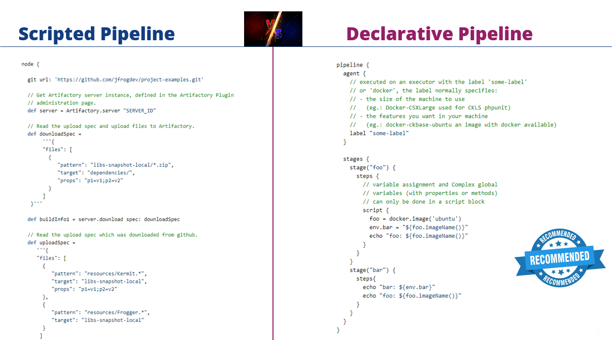

# Exercise 02 : Jenkins agent

- [Aim](#aim)
- [Definition of a Jenkins agent](#definition-of-a-jenkins-agent)
- [Why using a declarative pipeline against scripted pipeline ?](#why-using-a-declarative-pipeline-against-scripted-pipeline-)
- [Step 01 - Create a new pipeline](#step-01---create-a-new-pipeline)
  - [Step01 - Focus on some directives](#step01---focus-on-some-directives)
  - [Step01 - Focus on agent directive](#step01---focus-on-agent-directive)
- [Step 02 - Use the Snippet generator](#step-02---use-the-snippet-generator)

## Aim

Create a pipeline from this repository and see the usage of the docker agent.

## Definition of a Jenkins agent

In Jenkins architecture, an `agent` is an operating unit orchestrated by the main Jenkins
controller to provide a specific environment for your build project.

You can learn more about agents on the documentation: <https://www.jenkins.io/doc/book/using/using-agents/>

## Why using a declarative pipeline against scripted pipeline ?

There are a lot of advantages of using a declarative pipeline:

- **Code:** Pipelines are implemented in code and typically checked into source control, giving
  teams the ability to edit, review, and iterate upon their delivery pipeline.
- **Versatile:** Pipelines support complex real-world Continuous Development requirements,
  including the ability to fork/join, loop, and perform work in parallel.
- **Durable:** Pipelines can survive both planned and unplanned restarts of the Jenkins
  controller.
- **Pausable:** Pipelines can optionally stop and wait for human input or approval before
  continuing the Pipeline run.
- **Extensible:** The Pipeline plugin supports custom extensions to its Domain Specific Language(DSL)
  and multiple options for integration with other plugins. (we will see that later when talking about
  Jenkins shared library)
- **Syntax** is slightly different


## Step 01 - Create a new pipeline

using the dashboard you will create a second pipeline

- from the [jenkins dashboard](http://localhost:8080/) create a new pipeline using new item menu
- use `Exo02` as item name
- select pipeline type
- manually write the following pipeline code inside script field

```groovy
pipeline {
    agent { 
        docker { 
            image 'node:20.2.0-alpine3.17' 
        } 
    }
    stages {
        stage('build') {
            steps {
                sh 'node --version'
            }
        }
    }
}
```

- finally execute the pipeline using `build now` button

- check the [logs of your build](http://localhost:8080/job/Exo02/lastBuild/console), you should
  see "node version ..."

### Step01 - Focus on some directives

- Stages are used to structure your builds
- Stages are displayed as columns in jenkins UI
- Steps are subdivision of the stages

### Step01 - Focus on agent directive

By declaring a docker agent with the given docker node image, the `sh` directives are executed
inside an "instance" of this agent (a docker container) that is automatically provided on a node
pre-configured to accept Docker-based Pipelines (provided by the docker plugin), or on a node
matching the optionally defined label parameter. `docker` directive also optionally accepts an `args`
parameter which may contain arguments to pass directly to a docker run invocation. For example:

```groovy
agent {
    docker {
        image 'node:20.2.0-bullseye-slim'
        label 'docker-node'
        args  '-v /tmp:/tmp'
    }
}
```

## Step 02 - Use the Snippet generator

Using the [Snippet generator](http://localhost:8080/pipeline-syntax/), add a second stage that
will build the pipeline named *Exo01* that you created in [Exercise 1](/Exercise01.md)

Hint: in snippet generator select the *build* directive sample step

If you are lost, simply use the following pipeline:

```groovy
pipeline {
    agent { 
        docker { 
            image 'node:20.2.0-alpine3.17' 
        } 
    }
    stages {
        stage('build') {
            steps {
                sh 'node --version'
            }
        }
        stage('build Exo01') {
            steps {
                build 'Exo01'
            }
        }
    }
}
```
