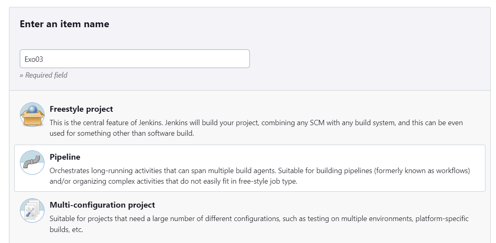
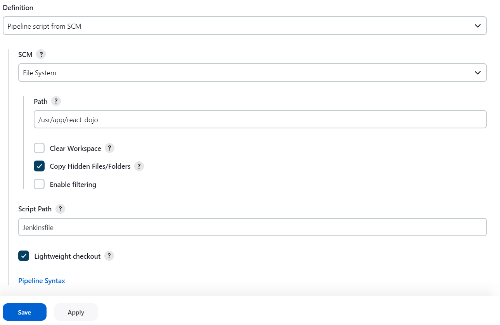
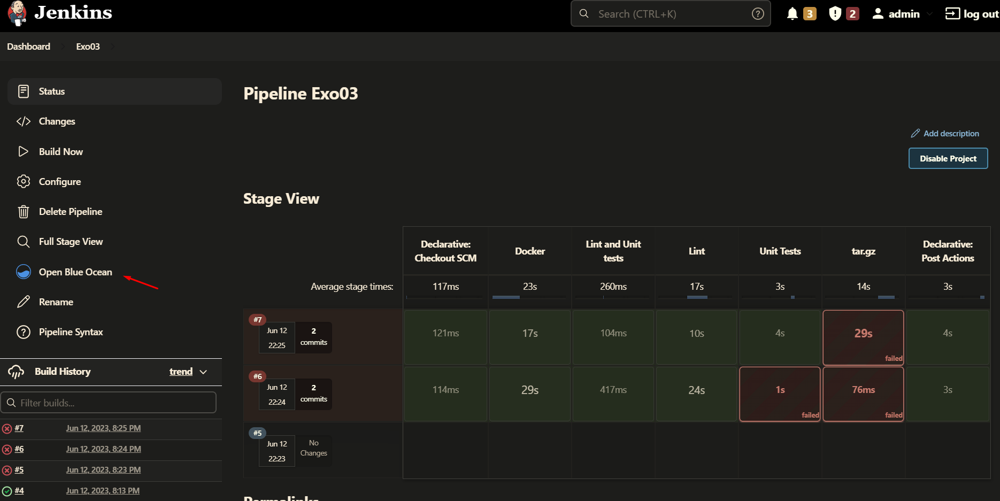
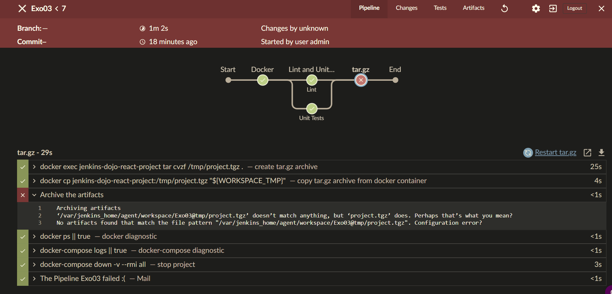

# Full example

- [Agent / Node](#agent--node)
- [Step 01 - Pipeline and jenkinsfile validation](#step-01---pipeline-and-jenkinsfile-validation)
  - [Step 01a - Create a new pipeline based on SCM](#step-01a---create-a-new-pipeline-based-on-scm)
  - [Step 01b - enable jenkins pipeline linter in vscode](#step-01b---enable-jenkins-pipeline-linter-in-vscode)
  - [Step 01c - fix the Jenkinsfile manually](#step-01c---fix-the-jenkinsfile-manually)
- [Step 02 - build the docker image](#step-02---build-the-docker-image)
  - [Step 02 - Tip 1: useful commands](#step-02---tip-1-useful-commands)
  - [Step 02 - Tip 2: sh directive](#step-02---tip-2-sh-directive)
  - [Step 02 - Note about docker image tag](#step-02---note-about-docker-image-tag)
  - [Step 02 - Bonus : Add Dockerfile linting](#step-02---bonus--add-dockerfile-linting)
  - [Step 02 - Solution](#step-02---solution)
- [Step 03 - lint the project](#step-03---lint-the-project)
  - [Step 03 - Tip : ensure you stop the project properly](#step-03---tip--ensure-you-stop-the-project-properly)
- [Step 04 - run project unit tests](#step-04---run-project-unit-tests)
- [Step 05 - parallelize some stages](#step-05---parallelize-some-stages)
  - [Step 05 - Blue ocean view](#step-05---blue-ocean-view)
- [Step 06 - tar.gz archive](#step-06---targz-archive)
  - [Step 06 - Tip 1: useful commands](#step-06---tip-1-useful-commands)
  - [Step 06 - Tip 2: archiveArtifacts directive](#step-06---tip-2-archiveartifacts-directive)
- [Step 07 - Parameters](#step-07---parameters)

The directory [/react-dojo/](/react-dojo/) contains a react project that has been automatically
generated using the command `npx create-react-app react-dojo`.

This project also includes a `docker-compose.yml` file that allows you to launch the project.

The aim of this exercise is to improve step by step a basic `Jenkinsfile` to be created
in [react-dojo directory](/react-dojo/).

The final Jenkinsfile will allow to:

- build docker image with nodejs inside
- lint the project
- unit test the project
- create a build package, we will simply create a tar.gz archive
  - add a parameter to build the package (optional stage build)

The aims of this exercise are :

- to learn declarative Jenkinsfile syntax
- to learn how to run a pipeline from scm
- to add multiple steps/stages
- to see how to create conditional steps (eg: create package based on parameter)

## Agent / Node

It's important to note that to avoid to run expensive commands on the controller, we
will use the following syntax to target a specific agent on which the Jenkinsfile's
commands will run onto.

> *Nodes* are the *machines* on which build *agents* run. Agents manage the
> task execution on behalf of the Jenkins controller by using executors. An agent
> is actually a small (170KB single jar) Java client process that connects to a
> Jenkins controller and is assumed to be unreliable.

```groovy
pipeline {
    agent {
        label 'docker'
    }
    stages {
      // ...
    }
}
```

You can check [node configuration](http://localhost:8080/computer/main-agent/configure). **But do
not change any parameter**. You can see in this configuration that this node can be targeted using
`docker` label.

## Step 01 - Pipeline and jenkinsfile validation

**Aim**: create a pipeline via SCM (Source Control Management) and fix Jenkinsfile errors.

### Step 01a - Create a new pipeline based on SCM

Create the file **Jenkinsfile** in the directory **react-dojo** based on the simple
file [/react-dojo/JenkinsfileStep01](/react-dojo/JenkinsfileStep01).

Next create a new pipeline project


We will not use real git repository as you would do in your real projects. We will use the plugin
`filesystem_scm` that **SHOULD NOT BE USED IN PRODUCTION** but that allows to provide the pipeline
script directly via a folder to simplify our life during this coding dojo.

You will provide the following path `/usr/app/react-dojo` in the pipeline options of the build as follow:



Save and build this pipeline.

Notice that the build is failing, analyze the build logs to understand why.

### Step 01b - enable jenkins pipeline linter in vscode

Follow this step only if you are using *VsCode* editor (recommended).
Otherwise jump to [Step 01c - fix the Jenkinsfile manually](#step-01c---fix-the-jenkinsfile-manually)

Jenkinsfile linting highly depends on plugins that are installed on the jenkins server, as some
directives are available only when related plugins are installed. It means that you have to lint
your file using the jenkins server you are targeting.
Please use the following instructions to configure the *VsCode linter*:

- install the extension `janjoerke.jenkins-pipeline-linter-connector` in VsCode
- The script `setup.sh`, you run at the beginning of the coding dojo, automatically created the
  file `.vscode/settings.json` that partially configured this plugin. You need to create a jenkins
  token in your jenkins account. To do this, connect to <http://localhost:8080/user/admin/configure>
  and click on *Add new token*.


- set any label you want and click on *Generate* button
- copy the token generated and paste it in the file `.vscode/settings.json`
  as `jenkins.pipeline.linter.connector.pass` property's value.
- you may also have to fix the `jenkins.pipeline.linter.connector.url` http port according to
  your configuration

**Security Note**: `jenkins.pipeline.linter.connector.pass` must neither be shared nor committed on
a repository. This is why `.vscode/settings.json` has been added to `.gitignore` file and is generated
via `.vscode/settings.template.json` file. Alternatively, you can save this configuration in vscode
settings at user level instead of workspace level.

You are now able to lint your Jenkinsfile:

- Open the Jenkinsfile just created before.
- Use the following shortcut `Ctrl-Alt-V` or use the Menu `View > Command Palette > Validate Jenkinsfile`.
- Follow the instructions given by the linter to fix the issue in the Jenkinsfile.

Build the pipeline.

### Step 01c - fix the Jenkinsfile manually

If you are not using *VsCode*, you just have to fix the Jenkinsfile manually by
adding the missing closing accolade `}` at the end of the file.

Build the pipeline.

## Step 02 - build the docker image

**Aim**: Update </react-dojo/Jenkinsfile> by replacing Stage01 content in order to build
the docker image.

In a real project, we do not build docker image from scratch, normally we follow these steps:

- lint the Dockerfile (**Best practice**)
- pull the image from docker registry (in our case it will be a private registry), it allows to
  populate docker build cache (**Best practice**)
- build the docker image, if Dockerfile haven't change, it will will be quick as it will use
  cache.
- test the resulting docker image (**Best practice**)
- push the built image to registry (so it can be retrieved on the next build)
  
**Note**: in [docker-compose.yml](/docker-compose.yml) a local docker registry service allows to
simulate a real docker registry. this registry is accessible from the container using the
following domain:port `docker-registry:5000`

:bulb: Use the two tips below to help you

### Step 02 - Tip 1: useful commands

Use the following commands to pull, build, test, push the image

```bash
# try to pull image from local repository
docker pull docker-registry:5000/react-dojo:v1 || true

# build the image, it will use docker cache populated using docker pull
docker build -t docker-registry:5000/react-dojo:v1 .

# test the image, here a simple node version test
docker run --rm docker-registry:5000/react-dojo:v1 node --version | grep -E '^v20.2.0$'

# push the image to the registry
docker push docker-registry:5000/react-dojo:v1
```

### Step 02 - Tip 2: sh directive

to execute a shell script, simply use the following [Jenkinsfile sh directive](https://www.jenkins.io/doc/pipeline/steps/workflow-durable-task-step/#sh-shell-script)

```groovy
sh 'shell script to execute'
```

or more verbosely:

```groovy
sh label:'docker image pull', script:'''#!/bin/bash
  # content of your script
'''
```

sh directive must be encapsulated inside a steps directive itself inside a stage, like in the
following example:

```groovy
pipeline {
    agent any
    stages {
        stage('Example') {
            steps {
                echo 'Hello World'

                sh "echo 'Hello from shell'"

                // groovy script
                script {
                  print "Hello from groovy"
                }
            }
        }
    }
}
```

### Step 02 - Note about docker image tag

**Almost never use latest tag**. With docker, *latest* tag is automatically applied to the latest
image built. By using latest tag, if the image is upgraded to a new version, your code could
not be compatible with the new version anymore (php:latest could match php:9 or 10).
Even worse, let's say you are using mysql:latest image and mysql decide to
upgrade an old version of mysql image(eg: 5.5), mysql:latest will give you the mysql 5.5
version (I guess it would not be the case with mysql but with other image providers, it could).

As a best practice, always use package versioning for:

- apt packages
- apk packages
- node modules (use package-lock.json)
- python modules
- ...

If you want to know more about this subject, check the Dockerfile files of this project
and you can refer to this documentation
[How to write Dockerfile / docker-compose.yml](/docs/HowToWrite-Dockerfile-DockerCompose.md)

### Step 02 - Bonus : Add Dockerfile linting

Before building the image, lint the Dockerfile using this command:

`hadolint Dockerfile`

**Note:** hadolint command has been made available on the [slave node docker image](.docker/jenkins-agent/Dockerfile),
commands availability depends on node configuration, alternatively we could have used docker
image hadolint/hadolint to lint this Dockerfile.

### Step 02 - Solution

If you are lost, use the [react-dojo/JenkinsfileStep02 file](/react-dojo/JenkinsfileStep02)

## Step 03 - lint the project

The aim of this step is to lint the `react-dojo` project.
To help you in this task you can use the 4 following commands:

- Command to launch the project (ensuring docker images are built, image build done in previous stage):

`docker-compose up -d --build`

- Command to run eslint:

`docker exec jenkins-dojo-react-project npm run lint:js`

- Command to run stylelint:

`docker exec jenkins-dojo-react-project npm run lint:css`

- Command to stop the project:

`docker-compose down -v --rmi all`

Add a new stage named "Lint" and add the different steps to run the containers, run the tests,
stop the containers.

**Suggestion**: stop the containers from post directive (please check next tip below).

**Note:** Here we have chosen to use docker-compose commands, but we could have used docker agent like
we did in [Exercise 02](/Exercise02 - Pipeline using docker agent.md).

### Step 03 - Tip : ensure you stop the project properly

To ensure to clean up the workspace, you can use post process directives like in this example:

```groovy
pipeline {
    agent any
    stages {
        stage('Test') {
            steps {
                sh 'make check'
            }
        }
    }
    post {
        always {
            junit '**/coverage/*.xml'
        }
        failure {
            // diagnostic instructions, you could also cat files, ...
            sh label:'docker diagnostic', script:'docker ps || true'
            sh label:'docker-compose diagnostic', script:'docker-compose logs || true'
            // check https://plugins.jenkins.io/email-ext/ for other options
            mail to: 'team@example.com', 
              subject: "The Pipeline ${JOB_NAME} failed :(",
              body: 'build detail'
        }
    }
}
```

More information on [Post directives documentation](https://jenkins.io/doc/book/pipeline/syntax/#post)

In this example, email will be sent to a local smtp server including a mail UI accessible via <http://localhost:1080>

## Step 04 - run project unit tests

The aim of this step is to run the unit test of the `react-dojo` project.

To help you in this task you can use the following commands:

- Command to run the test (env variable CI=true avoids to stay in watch mode):

`docker exec -e CI=true jenkins-dojo-react-project npm run test`

- Command to stop the project:

`docker-compose down -v --rmi all`

Add a new stage named "Unit Tests" and add the different steps to run the containers, run the tests.

**Hint 1**: docker-compose up has already been done in previous stage.

**Hint 2**: Stop the containers using post directive.

**Hint 3**: Take as an example the stage that is linting the project

## Step 05 - parallelize some stages

The aim of this step is to parallelize the *Lint* and *Unit tests* stages.

- use the parallel directive (more information about [parallel directive](https://www.jenkins.io/blog/2017/09/25/declarative-1/))
- note that `docker-compose up -d` command has to be moved before so the containers will
  be available for both stages (lint and unit test). You can move this command to "Docker" stage or
  create a specific stage if you wish.
- note that of course in this dojo, parallel tasks actually run on your own machine, but in real
  project, you can run tasks in parallel on multiple nodes (physical machines).

From now to gain time while testing your Jenkinsfile, you could remove the steps that
pull/build docker image in `Docker` stage, and the step that do the `docker-compose down`.
Just keep the step `docker-compose up`.

### Step 05 - Blue ocean view

You can better view parallel stages using blue ocean view.
You can switch to this view via the *Open blue ocean* button in *build view*.


You should see something like that:


## Step 06 - tar.gz archive

The aim of this step is to build a tar.gz archive of the `react-dojo` project.
In real projects, you could publish html and assets to cloudflare or build a
docker image that you could push on kubernetes using a helm chart.

Add a new step:

- create tar.gz archive
- to store the tar.gz in the build, use [archiveArtifacts directive](https://www.jenkins.io/doc/pipeline/steps/core/#code-archiveartifacts-code-archive-the-artifacts)

### Step 06 - Tip 1: useful commands

The creation of the tar.gz archive can be done in 2 steps:

- create the archive using tar command to (excluding the archive file itself. Please note that
  node_modules folder is not inside the archive because this folder is a docker volume):

```bash
mkdir -p "${WORKSPACE_TMP}" || true
# create tar archive outside of current directory to avoid `tar: .: file changed as we read it` error
tar -cvzf "${WORKSPACE_TMP}/project.tgz" .
mv "${WORKSPACE_TMP}/project.tgz" "${WORKSPACE}/project.tgz"
```

**Note**: WORKSPACE is a special variable that represents the absolute path of the directory
assigned to the build as a workspace.
See the [complete list of jenkins variables](http://localhost:8080/pipeline-syntax/globals).

### Step 06 - Tip 2: archiveArtifacts directive

In this step we will use the archiveArtifacts directive.
You can find documentation and generate code using [the snippet generator](http://localhost:8080/pipeline-syntax/).

:bulb: When using the snippet generator, only the file name is required.

## Step 07 - Parameters

The aim is to add a parameter to make the tar.gz stage optional.

Here the documentation that specify all the [available parameters](https://www.jenkins.io/doc/book/pipeline/syntax/#parameters).

```groovy
pipeline {
    agent any
    parameters {
        string(name: 'PERSON', defaultValue: 'Mr Jenkins', description: 'Who should I say hello to?')

        text(name: 'BIOGRAPHY', defaultValue: '', description: 'Enter some information about the person')

        booleanParam(name: 'TOGGLE', defaultValue: true, description: 'Toggle this value')

        choice(name: 'CHOICE', choices: ['One', 'Two', 'Three'], description: 'Pick something')

        password(name: 'PASSWORD', defaultValue: 'SECRET', description: 'Enter a password')
    }
    stages {
        stage('Example') {
            steps {
                echo "Hello ${params.PERSON}"

                echo "Biography: ${params.BIOGRAPHY}"

                echo "Toggle: ${params.TOGGLE}"

                echo "Choice: ${params.CHOICE}"

                echo "Password: ${params.PASSWORD}"
            }
        }
    }
}
```

Using the previous Jenkinsfile add:

- a *parameters* section with a *choice* parameter named targetEnv with 2 possible values: prod, none
- add a [when directive](https://www.jenkins.io/doc/book/pipeline/syntax/#when) to only
  execute *tar.gz* stage when parameter targetEnv value is prod.

**Note**: The first time the pipeline will be executed, it could fail, and then *Build now* button will
be changed to *Build with parameters*.

Try to launch the build using targetEnv value *none*. *tar.gz* stage should be skipped without error.
